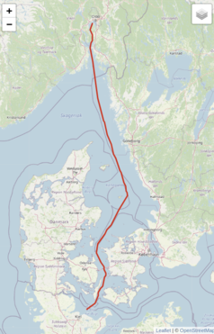

# Ferrybox code challenge

In this task, we'd like you to work with data collected via the [NorSOOP infrastructure project](https://www.norsoop.com/). 

## Table of contents
- [NorSOOP](#norsoop)
- [Disclaimer](#disclaimer)
- [Terminology](#terminology)
- [Units](#units)
- [Example data](#example-data)
- [Code challenge](#code-challenge)
    - [Task 1](#1-quality-control-on-the-following-measurements)
    - [Task 2](#2-plan-a-data-ingestion-pipeline)
- [Delivery](#delivery)
- [Contact](#contact)


## NorSOOP


NorSOOP (Norwegian Ships of Opportunity program) is a national research infrastructure that uses ships of opportunity, such as container ships, ferries, and cruise ships, to support oceanic and atmospheric research and observations. NorSOOP will help to find ways to detect and manage human impacts on the ocean.

Various ships are equipped with a "Ferrybox" which is a collection of sensors that read out measurements every minute. The map below shows the path of Color Fantasy which is one of the Ships of Opportunity.



The ships typically follow a planned transect between two or more ports, as can be seen in the picture. 


## Disclaimer

The data provided in this repository is not quality controlled and should not be used in any real application. The intention of this repository is to serve as a code challenge during interviews at NIVA.

## Terminology

#### Measurement

A single reading from a sensor. A signal can typically have many
measurements all sharing the same timestamp.

#### Signal

A universally unique ID for each signal. Usages:

- Duplicate detection
- State tracking during data ingestion
- Logging

#### Pump

The Ferrybox system pumps in water to perform measurements. If the pump is off, the system keeps measuring the same water. Pump status is indicated by <platform_code>/ferrybox/SYSTEM/PUMP (1 is on, 0 is off).

#### Platform / Data source

In the context of Ferrybox, the platform is the actual vessel. Identified by platform_code. 

## Units

- All temperature measurements are done in Celsius
- Location is using WGS 84 coordinates 
- time format is using iso 8601 timestamps in UTC timezone

TODO: we are missing the units for the rest of the measurements

## Example data

The [data](./data) directory contains an example of measurements from Color Fantasy. Each file may contain several readings. Below is an example signal:

```json
 {
      "properties": {
        "datetime": "2020-03-05T13:45:24",
        "platform_code": "FA",
        "signal_id": "287e6d03-d86e-474a-ae80-14fbd49c3e69"
      },
      "measurements": {
        "FA/ferrybox/GPS/TIME": 0.5731712962962963,
        "FA/ferrybox/SYSTEM/PUMP": 1.0,
        "FA/ferrybox/SYSTEM/OBSTRUCTION": 0.0,
        "FA/ferrybox/SAMPLER/MANUAL_COUNTER": 0.0,
        "FA/ferrybox/SAMPLER/AUTOMATIC_COUNTER": 0.0,
        "FA/ferrybox/SYSTEM/TRIP_NUMBER": 12560.0,
        "FA/ferrybox/TURBIDITY": 3.13,
        "FA/ferrybox/CHLA_FLUORESCENCE/RAW": 0.05,
        "FA/ferrybox/CHLA_FLUORESCENCE/ADJUSTED": 0.015,
        "FA/ferrybox/INLET/TEMPERATURE": 3.433,
        "FA/ferrybox/CTD/TEMPERATURE": 3.969,
        "FA/ferrybox/CTD/SALINITY": 24.992,
        "FA/ferrybox/OXYGEN/CONCENTRATION": 393.425,
        "FA/ferrybox/OXYGEN/SATURATION": 96.466,
        "FA/ferrybox/OXYGEN/TEMPERATURE": 4.146,
        "FA/ferrybox/CDOM_FLUORESCENCE/RAW": 5.45,
        "FA/ferrybox/CDOM_FLUORESCENCE/ADJUSTED": 5.45,
        "FA/ferrybox/CYANO_FLUORESCENCE/RAW": 3.68,
        "FA/ferrybox/CYANO_FLUORESCENCE/ADJUSTED": 3.68,
        "FA/ferrybox/INLET/OXYGEN/SATURATION": 90.66,
        "FA/ferrybox/INLET/OXYGEN/CONCENTRATION": 355.338,
        "FA/ferrybox/INLET/OXYGEN/TEMPERATURE": 5.684,
        "FA/ferrybox/PAH_FLUORESCENCE/RAW": 5.45,
        "FA/ferrybox/PAH_FLUORESCENCE/ADJUSTED": 5.45
      },
      "measured_flags": {
        "FA/ferrybox/QC/G0/SYSTEM/DATA_FLAG_UNDERWAY": 1.0
      },
      "location": {
        "FA/gpstrack": {
          "longitude": 10.5642,
          "latitude": 59.7269
        }
      }
    }
```

Each measurement is identified by a unique string with a corresponding value. 

TODO: provide a description of the different instruments (INLET, CTD, etc.)

## Code challenge
Sensors can sometimes read out wrong values, especially sensors sitting in water. The example data provided is not quality controlled.  Before the interview, we'd like you to write code solving the tasks below.

### 1. Quality control on the following measurements:

- FA/ferrybox/INLET/TEMPERATURE
- FA/ferrybox/CTD/TEMPERATURE
- FA/ferrybox/OXYGEN/TEMPERATURE

Create a code solution that can detect and filter out any anomalies that may have caused wrong measurements. You can use the example data in [data](./data) directory. The code solution should be applicable to a live monitoring system.

### 2. Plan a data ingestion pipeline

Plan an overall architecture for a cloud infrastructure ingesting Ferrybox data. The ingested data should be made available for data analysis externally. 

Consider the following requirements:

- Due to limited internet connectivity files are not always uploaded chronologically
- It is important to avoid data loss
- If quality control code is changed, historical data should be re-ingested

The actual Ferrybox system can be considered out of scope, we can expect the system to upload files at a regular basis.

## Delivery

Before the interview, we would like you to prepare the following:

- Code solution to task 1 as a **private** github fork
- An oral presentation of the code solution and a presentation of a proposed architecture 

The code can be written in a language of your choice. The code challenge is mainly used as a basis for conversation. **We don't expect a perfect solution**. 

## Contact

Please don't hesitate to reach out to [hakon.rokenes@niva.no](mailto:hakon.rokenes@niva.no) if you have any questions.
